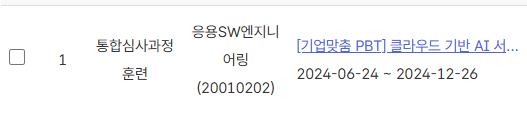

# 👋Welcome to my Portfolio

저는 2년제 대학교에서 사이버보안을 전공하며 리눅스, 네트워크, 파이썬, C언어 등을 학습하였습니다. 이 경험을 통해 **기술적인 기초와 시스템에 대한 깊은 이해**를 쌓았고, 이를 바탕으로 개발 분야에도 관심을 가지게 되었습니다.  
직장 생활을 병행하면서 자발적으로 개발 공부를 시작하였고, 다양한 **자체 프로젝트**를 통해 문제 해결 능력을 키웠습니다. 그러나 독학으로 한계에 부딪히면서, **보다 체계적이고 심화된 교육**을 받는 것이 중요하다고 판단하였고, 그 결과 **국비 지원 교육 제도**를 통해 6개월 동안 **백엔드 개발 교육을 이수**하게 되었습니다.
 
이 과정을 통해 **실무에 바로 적용 가능한 기술**을 배우고, **협업 및 프로젝트 개발 경험**을 쌓았습니다. **특히 데이터베이스 설계, RESTful API 개발, 클라우드 환경 배포** 등 다양한 백엔드 기술을 습득하였고, **전문가의 지도 아래** 빠르게 실력을 향상시킬 수 있었습니다.

이제, 저는 **문제 해결 중심의 개발자**로서, **백엔드 개발 분야에서의 전문성을 확립**하고, **업무에 실질적으로 기여할 수 있는 역량**을 갖추게 되었습니다. 포트폴리오를 통해 제 경험과 기술을 보여드리며, 더 나아가 **비즈니스 문제를 해결하고 혁신적인 시스템을 구축하는 개발자로 성장**할 준비가 되어 있습니다.

---

## ⚙️ Tech Stack

Here are the technologies I've worked with:

  
  
  
  
  
  
  
  
  
  

---

## 🛠 Projects

### [Project 1 MySampleBackend](Link to project)
A brief description of the project, the problem it solves, and the technologies used.  
- **Technologies used**: Java, Spring Boot, MySQL, Docker, S3 bucket, Spring Security
- [Link to GitHub repository](https://github.com/imsukju/MySampleBackend)
  - React 기반 프론트엔드에 맞춘 백엔드 서비스 개발
  - 사용자 등록, 로그인, 게시글 작성, 댓글 작성 등의 기능 구현
  - **Spring Security**를 사용한 사용자 인증 및 권한 관리

---

## Certifications & Courses  

### Certifications
- 정보처리 산업기사

### Courses
- 구미대학교 사이버 보안과 졸업
- 한국 IT 교육원 수료 
    
  
##  [교육과정 보기](./커리큘럼.md)  
--

## 📬 Contact

Feel free to reach out to me through:

- Email: [tjrwn1234562@gmail.com](mailto:tjrwn1234562@gmail.com)
- techBlog[티스토리 블로그](https://view790.tistory.com/category) {pw :hellosj489}

---

Thank you for visiting my portfolio! I'm always open to feedback and new opportunities.

